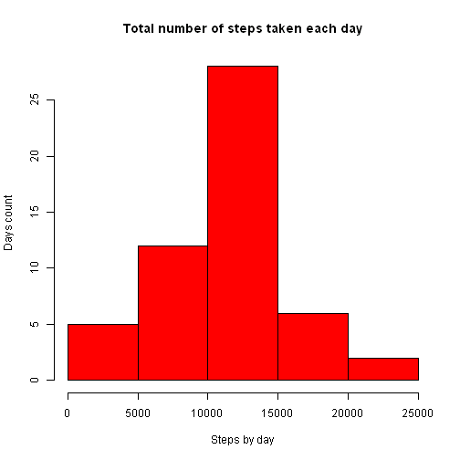
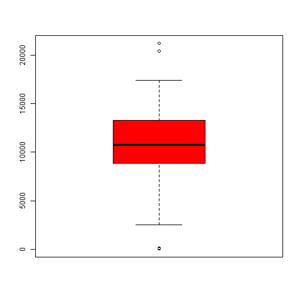
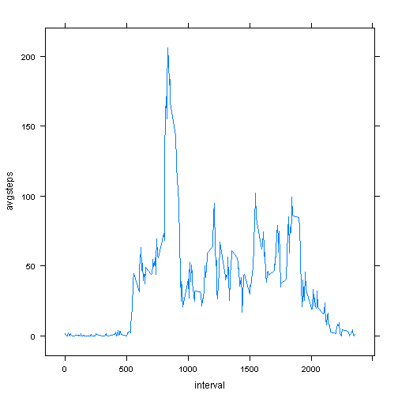
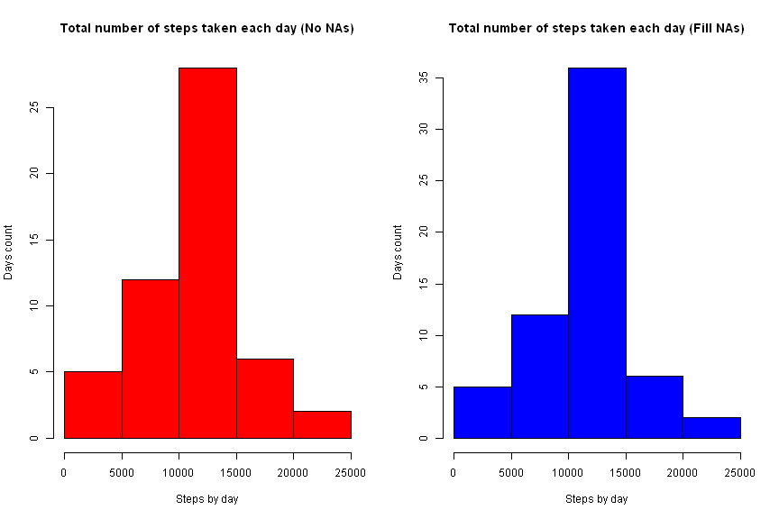
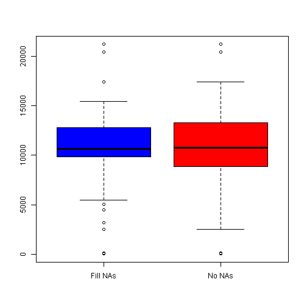
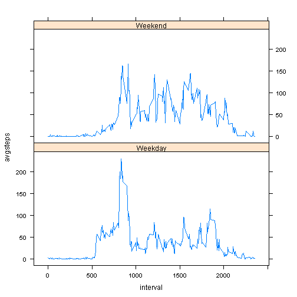

# Reproducible Research: Peer Assessment 1


## Loading and preprocessing the data

```r
library(sqldf)
```

```
## Loading required package: gsubfn
## Loading required package: proto
## Loading required package: RSQLite
## Loading required package: DBI
## Loading required package: RSQLite.extfuns
```

```r
library(lattice)
library(ggplot2)

dd<-read.table(unzip("./activity.zip"), header=TRUE, sep=",")
dd<-sqldf("select *, strftime('%w',date) as wdn from dd")
```

```
## Loading required package: tcltk
```

```r
dd<-sqldf("select *, case when wdn between 1 and 5 then 'Weekday' else 'Weekend' end as wd from dd")
```


## What is mean total number of steps taken per day?

```r
rr1<-sqldf("select date, wdn, wd, sum(steps) as sumsteps, avg(steps) as avgsteps from dd where steps is not null group by date, wdn, wd")
```
- ***Make a histogram of the total number of steps taken each day***

```r
par(mfrow=c(1,1))
dev=png
hist(as.numeric(rr1$sumsteps), col="red", main="Total number of steps taken each day", xlab="Steps by day", ylab="Days count")
```

 

- ***Calculate and report the*** **mean** ***and*** **median** ***total number of steps taken per day***  

```r
summary(as.numeric(rr1[!is.na(rr1$sumsteps),"sumsteps"]))
```

```
##    Min. 1st Qu.  Median    Mean 3rd Qu.    Max. 
##      41    8840   10800   10800   13300   21200
```
As you can see **mean** and **median** values are the same in this case: **10800 steps**.


```r
boxplot(as.numeric(rr1$sumsteps), col="red")
```

 


## What is the average daily activity pattern?

- ***Make a time series plot (i.e. type = "l") of the 5-minute interval (x-axis) and the average number of steps taken, averaged across all days (y-axis)***


```r
rr2<-sqldf("select interval, avg(steps) as avgsteps from dd where steps is not null group by interval")
xyplot(avgsteps~interval, data=rr2, type="l")
```

 
- ***Which 5-minute interval, on average across all the days in the dataset, contains the maximum number of steps?***

```r
sqldf("select interval, avgsteps from rr2 where avgsteps=(select max(avgsteps) from rr2)")
```

```
##   interval avgsteps
## 1      835    206.2
```
Maximum number of steps (**206.2**) in this pattern found at **835** interval.

## Imputing missing values

- ***Calculate and report the total number of missing values in the dataset (i.e. the total number of rows with NAs)***


```r
sqldf("select count(*) as [NA count] from dd where steps is null")
```

```
##   NA count
## 1     2304
```
- ***Devise a strategy for filling in all of the missing values in the dataset. The strategy does not need to be sophisticated. For example, you could use the mean/median for that day, or the mean for that 5-minute interval, etc.***

Now lets replace NAs with average values of activity pattern from previous study

- ***Create a new dataset that is equal to the original dataset but with the missing data filled in.***


```r
dd1<-sqldf("select a.date, a.wdn, a.wd, a.interval, case when a.steps is null then b.avgsteps else a.steps end as steps from dd a inner join rr2 b on a.interval = b.interval ")

rr3<-sqldf("select date, wdn, wd, sum(steps) as sumsteps, avg(steps) as avgsteps from dd1 group by date, wdn, wd")
```
- ***Make a histogram of the total number of steps taken each day and Calculate and report the mean and median total number of steps taken per day. Do these values differ from the estimates from the first part of the assignment? What is the impact of imputing missing data on the estimates of the total daily number of steps?***


```r
par(mfrow=c(1,2))
hist(as.numeric(rr1$sumsteps), col="red", main="Total number of steps taken each day (No NAs)", xlab="Steps by day", ylab="Days count")
hist(as.numeric(rr3$sumsteps), col="blue", main="Total number of steps taken each day (Fill NAs)", xlab="Steps by day", ylab="Days count")
```

 

```r
par(mfrow=c(1,1))
rr4<-sqldf("select 'No NAs' as type,  * from rr1 union all select 'Fill NAs' as type,  * from rr3 order by type desc")
boxplot(rr4$sumsteps ~ rr4$type, col=c("blue", "red"))
```

 

Mean & median values (No NAs)

```r
summary(rr1$sumsteps)
```

```
##    Min. 1st Qu.  Median    Mean 3rd Qu.    Max. 
##      41    8840   10800   10800   13300   21200
```
Mean & median values (Fill NAs)

```r
summary(rr3$sumsteps)
```

```
##    Min. 1st Qu.  Median    Mean 3rd Qu.    Max. 
##      41    9820   10600   10700   12800   21200
```

## Are there differences in activity patterns between weekdays and weekends?


```r
rr5<-sqldf("select wd, interval, avg(steps) as avgsteps from dd1 group by wd,interval")
summary(rr5)
```

```
##       wd               interval       avgsteps     
##  Length:576         Min.   :   0   Min.   :  0.00  
##  Class :character   1st Qu.: 589   1st Qu.:  1.97  
##  Mode  :character   Median :1178   Median : 28.06  
##                     Mean   :1178   Mean   : 38.93  
##                     3rd Qu.:1766   3rd Qu.: 61.20  
##                     Max.   :2355   Max.   :230.36
```

```r
xyplot(avgsteps~interval|wd , data = rr5, type="l", layout = c(1,2) )
```

 
